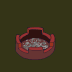

<div align="center">



# gimme-a-brake

[](../../releases/latest)
[](../../releases/latest)

**Sopranos-style context reset ritual for AI coding agents.**
Drop it into any project. When your agent's context runs long — or you tell it to take five — it stops, smokes, and comes back clean.

</div>

---

## What it does

Long agentic sessions degrade. Context fills up, the model drifts, mistakes creep in. **gimme-a-brake** gives your agent (and you) a hard, ritualized stopping point — a forced pause with personality, not just a silent timeout.

Two pieces, one ritual:

| Piece | What it is |
|---|---|
| `smoke_break.py` | Drop-in script + hook. Fires a Sopranos-quote countdown in your terminal whenever context runs long, a task boundary hits, or you say `gimme a break`. |
| **SmokeBreak.app** | Native macOS menu-bar companion. Pops a clean overlay toast with your CLI's logo, an animated smoking-break gif, the quote, a live countdown — and a Sopranos voice clip picked by how hard the session's been working. |

---

## Features, ranked

1. **Hook-native** — wires into Claude Code's `Stop` and `Notification` hooks via `.claude/settings.json`. Fires automatically; no manual babysitting.
2. **Keyword triggers** — say `gimme a break`, `smoke`, or `take five` and the agent stops immediately, no questions asked.
3. **Native macOS overlay** — a real menu-bar agent (`SmokeBreak.app`), not a notification banner. Animated gif, CLI-aware logo (Claude Code / Codex), live countdown bar, auto-dismiss.
4. **Token-aware sound design** — reads the session transcript, sums cumulative token spend, and picks a sound-effect *intensity tier* (low / medium / high) — then shuffles within that tier so you never hear the same line twice in a row.
5. **CLI-aware branding** — detects whether you're running Claude Code or Codex and swaps the logo in the overlay accordingly.
6. **Near-zero footprint** — `LSUIElement` menu-bar agent, ~70MB idle RSS, negligible CPU. It sits there quiet until it's needed.
7. **Launch-at-login, your call** — registers itself via `SMAppService` on first run; toggle it off anytime from the menu.
8. **Sopranos-authentic dialogue** — sixteen rotating Tony quotes plus real audio clips, because a generic "session timeout" message doesn't hit the same.

---

## Install

### macOS (available now)

**1. Download**

Grab `SmokeBreak-vX.Y.Z.zip` from [**Releases**](../../releases/latest) — it's
a Developer-ID-signed, hardened-runtime, **notarized and stapled** build.
Unzip it, drag `SmokeBreak.app` to `/Applications`. Opens cleanly on first
launch — no Gatekeeper warning, no right-click-to-open dance.

> ✅ **Verified working** — downloaded fresh from this repo's Releases,
> Gatekeeper-checked (`spctl: accepted / Notarized Developer ID`), and
> launched clean with the overlay firing on a live trigger. No quarantine
> prompt, no crash.

**2. Launch it once**

```bash
open /Applications/SmokeBreak.app
```

It lives quietly in your menu bar (`🚬`/`⏸`) and registers itself to launch
at login; toggle that from its menu anytime.

<details>
<summary>Building from source instead</summary>

```bash
cd SmokeBreakApp
SIGN_IDENTITY="Developer ID Application: Your Name (TEAMID)" ./build_app.sh
```

To also notarize and staple (zero Gatekeeper warnings), set `NOTARY_PROFILE`
to a keychain profile created via `xcrun notarytool store-credentials`:

```bash
SIGN_IDENTITY="Developer ID Application: Your Name (TEAMID)" \
NOTARY_PROFILE="your-keychain-profile" \
./build_app.sh
```

Omit `SIGN_IDENTITY` to ad-hoc sign for local use only.

</details>

**3. Wire the hook into your project**

Drop `smoke_break.py`, `CLAUDE.md`, and `settings.json` into your project root, then point your Claude Code hooks at it (already configured in `settings.json` here — copy it into your project's `.claude/settings.json` or merge the `Stop`/`Notification` blocks):

```json
{
  "hooks": {
    "Stop": [{
      "matcher": "",
      "hooks": [{ "type": "command", "command": "python3 smoke_break.py --duration 3 --reason agent_stop" }]
    }],
    "Notification": [{
      "matcher": "context",
      "hooks": [{ "type": "command", "command": "python3 smoke_break.py --duration 2 --reason context_warning --no-wait" }]
    }]
  }
}
```

That's it. The script auto-detects your CLI, derives token spend from the session transcript, and fires the overlay + sound alongside the terminal countdown — no extra wiring needed.

### Linux — TBD

Planned: a lightweight tray-icon companion (GTK or Qt) triggered the same way via the script's hook integration. Not yet built.

### Windows — TBD

Planned: a system-tray companion (WinUI or Tauri) with the same overlay/sound design. Not yet built.

---

## Configuration

`smoke_break.py` flags:

| Flag | Default | Purpose |
|---|---|---|
| `--duration N` | `3` | Break length in minutes |
| `--reason TEXT` | `context_limit` | Shown in the header / overlay |
| `--no-wait` | off | Print only, skip the countdown (CI/pipe mode) |
| `--gui` / `--no-gui` | on | Fire the macOS overlay alongside the terminal output |
| `--cli claude\|codex` | auto-detected | Override the overlay's logo |
| `--tokens N` | auto-derived from transcript | Override the sound-tier calculation |

---

## How the sound tiers work

The script reads the session's transcript JSONL (passed via the hook's `transcript_path`, or derived from `$CLAUDE_CODE_SESSION_ID` + cwd as a fallback), sums `input + output + cache_read + cache_creation` tokens, and buckets:

| Tokens | Tier |
|---|---|
| < 50,000 | low |
| 50,000 – 150,000 | medium |
| ≥ 150,000 | high |

Each tier shuffles through its own pool of clips, remembering the last one played (persisted across launches) so you don't get back-to-back repeats.

---

## Roadmap

- [x] Notarize the macOS build — Developer-ID signed, hardened runtime, notarized + stapled
- [ ] Linux tray companion
- [ ] Windows tray companion
- [ ] Configurable quote/sound packs

---

## License

MIT — do whatever you want with it. Just remember to take your break.
